# Getting Started with a Hands-On Lab

1. Once the environment is provisioned, you will be able to see the lab environment details under the **"Environment"** tab on your screen. 

    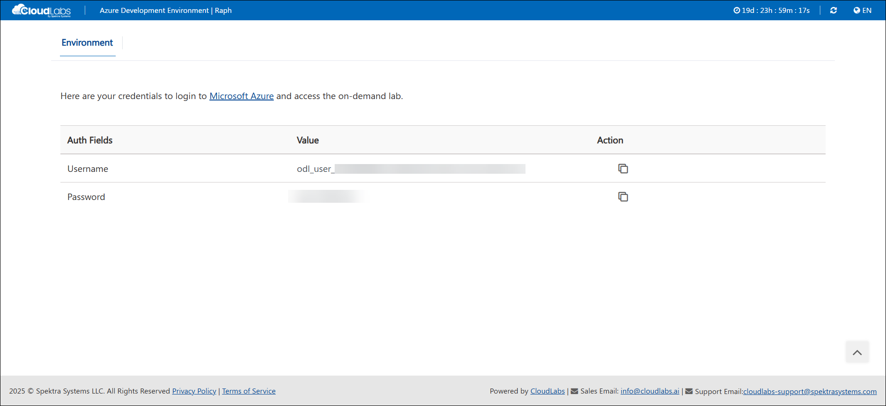

## Login to Azure Portal
1. Use the provided credentials to login to **portal.azure.com**.

    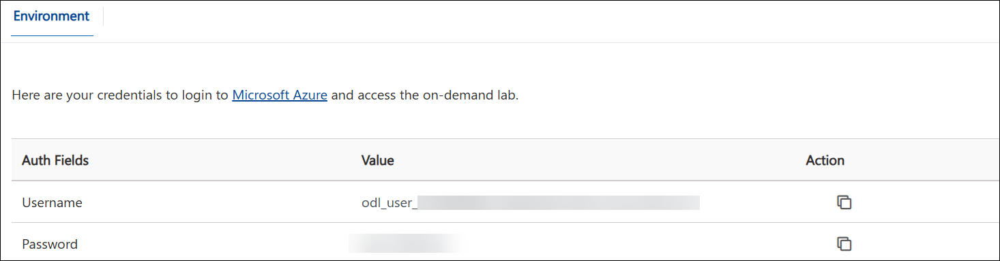

1. On **Sign into Microsoft Azure** tab you will see login screen, in that enter following email/username and then click on **Next**. 
   * Email/Username: <inject key="AzureAdUserEmail"></inject>

   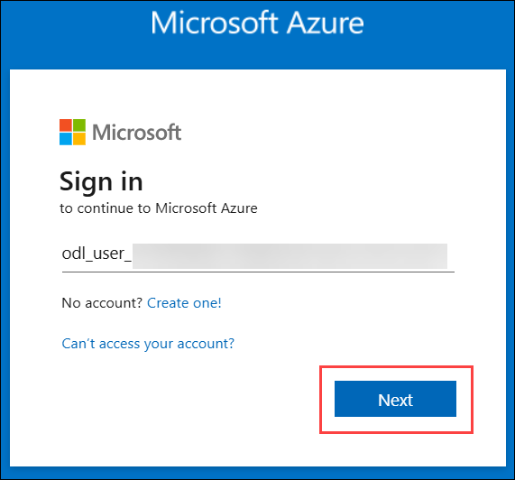
   
    
     
1. Now enter the following password and click on **Sign in**.
   * Password: <inject key="AzureAdUserPassword"></inject>

   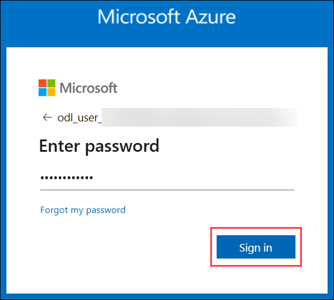

**Note**: If you see the pop-up **Action Required** for setting up two factor authentication click on **Next**.

   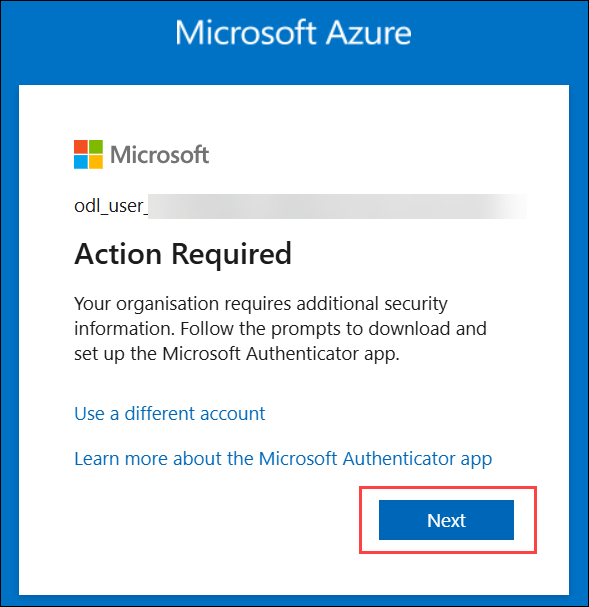

4. On Start by getting the app page, click on **Next**.

5. Click on **Next** twice.

6. In android, go to the play store and Search for **Microsoft Authenticator** and Tap on Install.
Note:For IOS, Open app store and repeat the steps.
Note: Skip If already installed.

   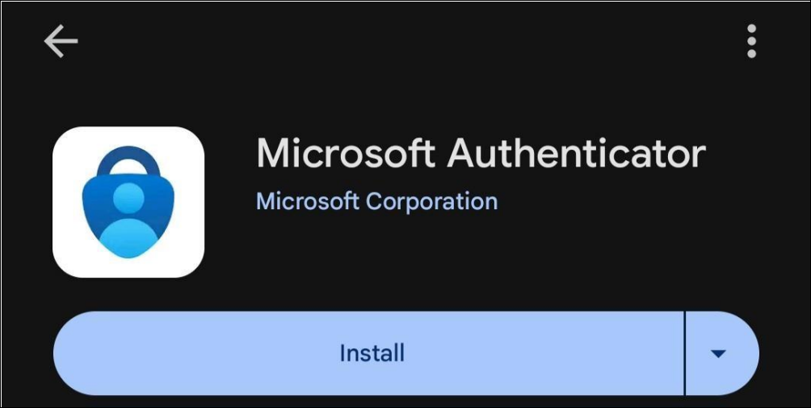

7. Open the app and tap on **Scan a QR code**.

8. Scan the QR code visible on the screen and click on Next.

   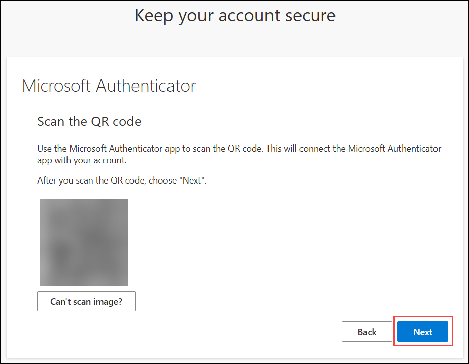

9. Enter the digit displayed on the Screen in the Authenticator app on mobile and tap on Yes.

   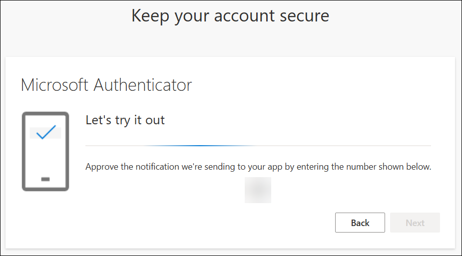

10. Once the notification is approved, click on Next.

   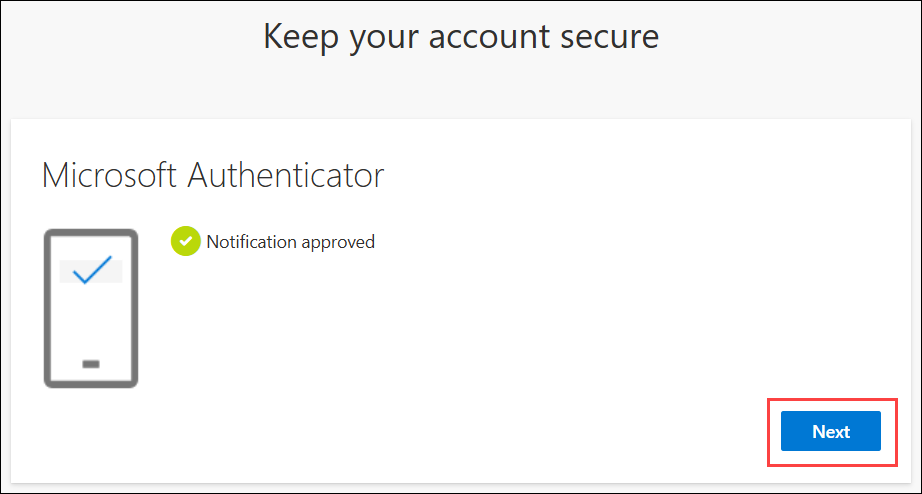

11. Click on Done.

   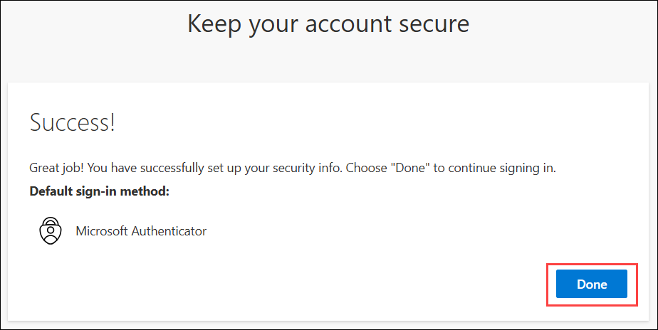

12. If prompted to stay signed in, you can click "No".

   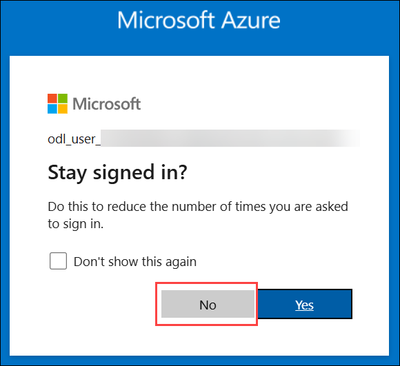

13. If a Welcome to Microsoft Azure pop-up window appears, simply click "Cancel" to skip the tour.

14. If you see the pop-up You have free Azure Advisor recommendations!, close the window to 
continue.

Please answer the following questions:
<question source="https://raw.githubusercontent.com/ar-59/InlineQuestion/refs/heads/main/samplequestions/openfieldquestion.md" />

<question source="https://raw.githubusercontent.com/ar-59/InlineQuestion/refs/heads/main/samplequestions/multichoicequestion.md" />

<question source="https://raw.githubusercontent.com/ar-59/InlineQuestion/refs/heads/main/samplequestions/openfieldquestion02.md" />